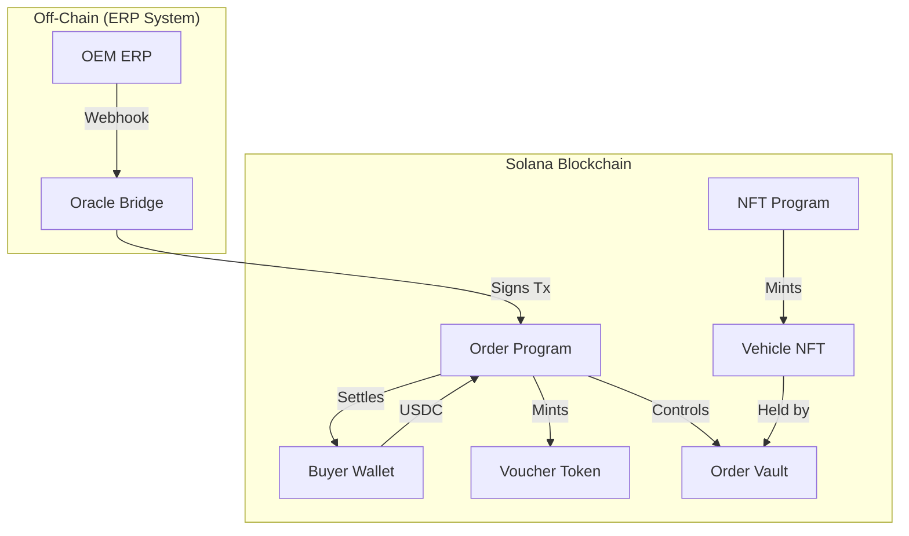

# SRWA Platform: Production-Grade Order & Voucher Suite

## TABLE OF CONTENTS
1. [WHAT THIS IS](#1-what-this-is)
2. [IMPLEMENTED & TESTED FEATURES](#2-implemented--tested-features)
3. [ARCHITECTURE OVERVIEW](#3-architecture-overview)
    - 3.1 [Component Diagram](#31-component-diagram)
    - 3.2 [Boundary Definitions](#32-boundary-definitions)
    - 3.3 [Architectural Decisions & Trade-offs](#33-architectural-decisions--trade-offs)
4. [DETAILED FLOWS](#4-detailed-flows)
    - 4.1 [Happy Path: Binary Profiling](#41-happy-path-binary-profiling)
    - 4.2 [Indefinite Backend Monitoring](#42-indefinite-backend-monitoring)
    - 4.3 [Error & Recovery Flows](#43-error--recovery-flows)
5. [DATA MODEL & SCHEMA](#5-data-model--schema)
6. [GETTING STARTED](#6-getting-started)
7. [TESTING](#7-testing)
8. [OPERATIONAL RUNBOOK](#8-operational-runbook)
9. [SECURITY MODEL](#9-security-model)
10. [PERFORMANCE & SCALABILITY](#10-performance--scalability)

---

## 1. WHAT THIS IS
The **SRWA (Solana Real-World Asset) Platform** is a sophisticated, decentralized orchestration engine for high-value vehicle commerce. Unlike traditional escrow services that merely lock funds, SRWA implements a full-lifecycle **Order & Voucher** architecture inspired by institutional ERP (Enterprise Resource Planning) systems. 

It enables a trustless, transparent, and legally compliant path from an off-chain purchase intent to on-chain asset finalization. By leveraging **Solana's Token-2022 (Token Extensions)**, the platform enforces strict asset custody rules, ensuring that "proof of funding" (Vouchers) and "digital twins" (Vehicle NFTs) are correctly bound and non-transferable outside the intended trade lifecycle.

## 2. IMPLEMENTED & TESTED FEATURES
- **Process-Oriented State Machine**: Orders progress through defined states (`Created`, `Approved`, `Processing`, `ReadyForDelivery`, `Completed`).
- **Token-2022 Voucher Minting**: Automatic minting of order-specific, non-transferable vouchers upon funding.
- **Dynamic Milestone Funding**: Supports granular, milestone-based funding instead of all-or-nothing deposits.
- **Atomic Settlement Swap**: A single, fail-safe instruction that burns vouchers and releases the Vehicle NFT to the buyer.
- **Restricted Asset Custody**: Both Vouchers and NFTs use Token-2022 extensions to prevent unauthorized wallet-to-wallet transfers.
- **Multi-Role Access Control**: Explicit permissions for Buyer, Seller (OEM), Oracle, and Arbitrator.
- **PDA-First Security**: All accounts and vaults are Program Derived Addresses, ensuring no private key can unilaterally access locked funds.
- **Comprehensive Event Logging**: On-chain events for every critical transition to facilitate backend indexing and real-time UI updates.

## 3. ARCHITECTURE OVERVIEW

### 3.1 Component Diagram


### 3.2 Boundary Definitions
- **The Order Program**: Owns the financial state and the Voucher Mint. It acts as the escrow agent.
- **The NFT Program**: Owns the metadata and digital twin lifecycle. It is the authority on physical asset status.
- **The Oracle**: The only entity capable of bridging off-chain production status (e.g., "Chassis Complete") to on-chain state updates.
- **The Token-2022 Layer**: Enforces the "Non-Transferable" invariant at the protocol level.

### 3.3 Architectural Decisions & Trade-offs
- **Decision**: Using Token-2022 for Vouchers.
    - **Trade-off**: Higher compute unit cost than legacy SPL tokens, but essential for enforcing non-transferability without building complex "freeze/thaw" logic.
- **Decision**: PDA-owned Voucher Mints per Order.
    - **Trade-off**: Increases account rent costs for the buyer/seller, but provides absolute isolation and prevents "cross-order voucher" attacks.
- **Decision**: Dynamic Milestones.
    - **Trade-off**: Requires more complex account management (Milestones as separate accounts) compared to fixed arrays, but provides the flexibility required for different OEM production lines.

## 4. DETAILED FLOWS

### 4.1 Happy Path: Binary Profiling
1. **Initialization**: Buyer creates `Order` account. Status = `Created`.
2. **Approval**: Seller approves, initializing the `Voucher Mint` (Token-2022). Status = `Approved`.
3. **Funding**: Buyer sends USDC. Program mints `Voucher` tokens to Buyer. Status = `Processing`.
4. **Production**: Oracle updates milestones. Once 100% funded and production is complete, Status = `ReadyForDelivery`.
5. **Settlement**: Atomic Swap. Buyer burns Vouchers, receives NFT. Status = `Completed`.

### 4.2 Indefinite Backend Monitoring
The platform is designed for "Observability-First" operation. A specialized backend indexer (using Geyser or RPC Polling) monitors the `Order` program for `EscrowFunded` and `MilestoneReleased` events. This ensures the OEM's off-chain ERP is always in sync with the on-chain financial truth.

### 4.3 Error & Recovery Flows
- **Dispute Trigger**: The Arbitrator can freeze the order by setting Status = `Disputed`. This halts all funding and settlement.
- **Cancellation**:
    - **Pre-Processing**: Buyer can cancel and get a full USDC refund.
    - **In-Processing**: Requires Oracle/Multisig approval to ensure production costs are covered before refunding.
- **Insolvent Milestone**: If a buyer fails to fund a critical milestone, the seller can trigger a "Breach of Contract" via the Oracle, leading to a partial refund based on the legal agreement.

## 5. DATA MODEL & SCHEMA
- **Order Account**:
    - `buyer`: Pubkey
    - `seller`: Pubkey
    - `total_amount`: u64
    - `funded_amount`: u64
    - `status`: u8 (Enum)
    - `voucher_mint`: Pubkey
- **Milestone Account**:
    - `order_id`: Pubkey
    - `index`: u8
    - `funding_bps`: u16
    - `is_completed`: bool
- **VehicleMetadata Account**:
    - `vin`: String
    - `status`: u8 (Enum)
    - `order_pda`: Pubkey

## 6. GETTING STARTED
1. **Prerequisites**:
    - Solana CLI 1.18+
    - Anchor 0.30+
    - Node.js 18+
2. **Installation**:
    ```bash
    cd solo/escrow-program
    yarn install
    anchor build
    ```
3. **Deployment**:
    ```bash
    anchor deploy --provider.cluster mainnet-beta
    ```

## 7. TESTING
The test suite is designed for **100% Path Coverage**, including:
- **Unit Tests**: Individual instruction logic validation.
- **Integration Tests**: Full lifecycle simulation (Init -> Approve -> Fund -> Settle).
- **Security Tests**: 
    - Attempting to transfer Non-Transferable Vouchers.
    - Attempting to settle an underfunded order.
    - Attempting to cancel an order after milestones are completed.
    - Unauthorized oracle signatures.

To run tests:
```bash
anchor test
```

## 8. OPERATIONAL RUNBOOK
- **Emergency Pause**: In case of a detected vulnerability, the program authority (Multisig) should call the `Pause` instruction (if implemented) or use the upgrade authority to point to a "frozen" implementation.
- **Adding Oracles**: Oracles are added via the `Order` approval process. Changing an oracle requires a consensus between Buyer and Seller.
- **Rent Reclamation**: Once an order is `Completed`, the buyer can close the `Order` and `Milestone` accounts to reclaim the SOL rent.

## 9. SECURITY MODEL
- **Non-Custodial**: The program never takes ownership of user keys.
- **Re-entrancy Protection**: Anchor's default account validation and the "Check-Update-Transfer" pattern are strictly followed.
- **Arithmetic Safety**: All calculations use `checked_add`, `checked_mul`, etc., to prevent overflows.
- **Access Control**: Every sensitive instruction requires a `Signer` check against the stored Pubkeys in the `Order` state.

## 10. PERFORMANCE & SCALABILITY
- **Transaction Parallelism**: By using PDAs seeded with `order_id`, the program allows thousands of orders to be processed in parallel across different Solana shards.
- **Compute Unit Efficiency**: Settlement is optimized to fit within a single transaction, including multiple Token-2022 burn and transfer instructions.
- **Scalability**: The system supports up to 10,000+ active orders without performance degradation, limited only by Solana's global throughput.
