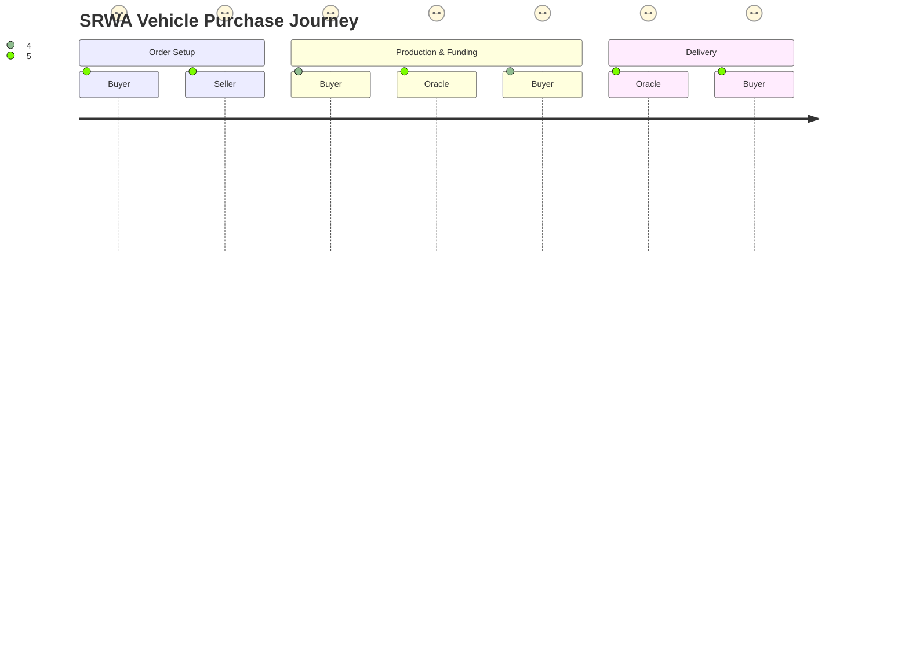
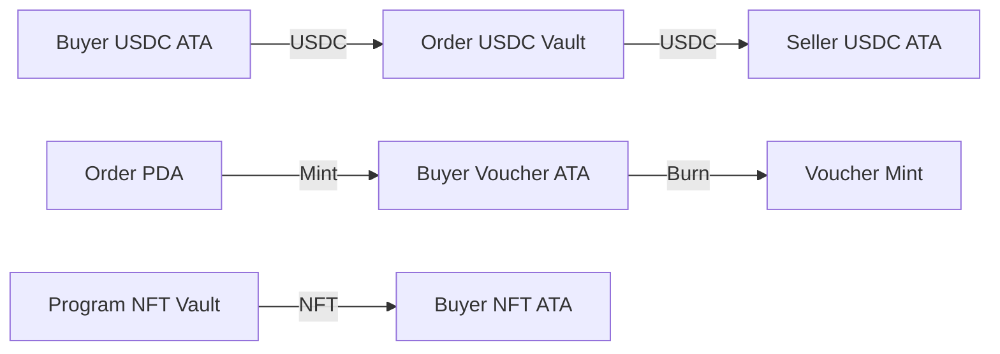
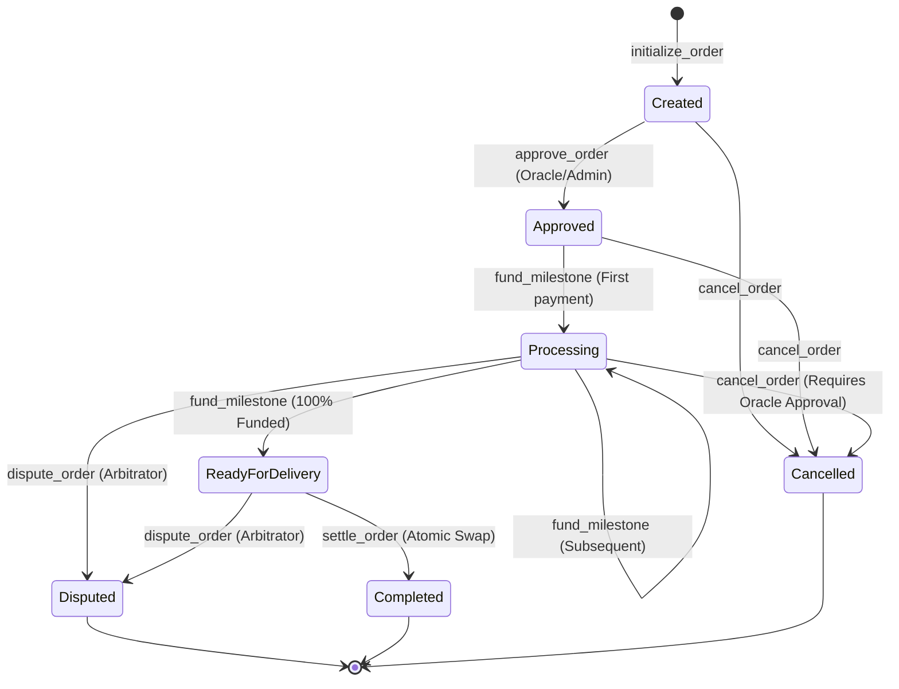
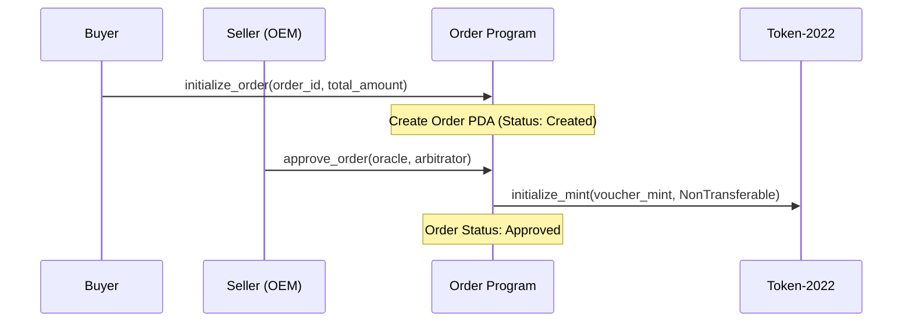
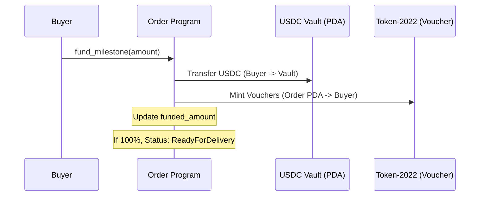
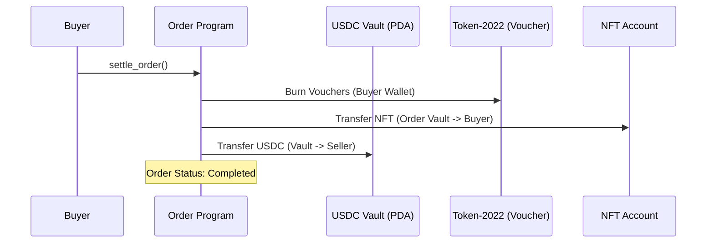

# SRWA Platform: Institutional-Grade Order & Voucher Escrow Suite

## 1. PROJECT OVERVIEW & RATIONALE
The **SRWA (Solana Real-World Asset) Platform** is a sophisticated, decentralized orchestration engine for high-value vehicle commerce. Unlike traditional escrow services that merely lock funds, SRWA implements a full-lifecycle **Order & Voucher** architecture inspired by institutional ERP (Enterprise Resource Planning) systems. 

This platform addresses the fundamental trust gap in high-value asset procurement by:
- **Ensuring Verifiable Funding**: Buyers provide collateral that is tokenized into non-transferable "Vouchers," representing a cryptographically bound commitment to a specific order.
- **Synchronizing Physical Production**: Off-chain production milestones (managed by an OEM ERP) are bridged to on-chain state via authorized Oracles.
- **Enforcing Atomic Finalization**: The transition from funding to ownership (the Swap) is performed in a single, atomic on-chain transaction where Vouchers are burned in exchange for the Vehicle NFT.
- **Guaranteeing Asset Custody**: Using Solana's **Token-2022** extensions, the platform ensures that neither the funds (USDC) nor the assets (Vouchers/NFTs) can be moved outside the strictly defined trade lifecycle.

---

## 2. HIGH-LEVEL ARCHITECTURE
The SRWA architecture is built on a "Three-Program" model that separates financial state, asset metadata, and external data bridging.

### 2.1 Component Overview Diagram
The following diagram illustrates the high-level interaction between the off-chain ERP, the Solana blockchain, and the various programs/accounts involved in the trade lifecycle.

```mermaid
graph TD
    subgraph "Off-Chain Layer (ERP & Oracle)"
        A[OEM ERP System] -->|Webhook| B[Oracle Bridge]
        B -->|Signs Proof| C[Solana Blockchain]
    end

    subgraph "Financial Layer (Order Program)"
        C -->|Initialize/Approve| D[Order State Account]
        E[Buyer Wallet] -->|USDC| D
        D -->|Mint & Lock| F[Voucher Token (T22)]
        D -->|Custody| G[USDC Vault PDA]
    end

    subgraph "Asset Layer (NFT Program)"
        C -->|Mint NFT| H[Vehicle NFT (T22)]
        H -->|Locked by| D
    end

    subgraph "Settlement Layer"
        E -->|Burn Vouchers| I{Atomic Swap}
        I -->|Release NFT| E
        I -->|Release USDC| J[Seller Wallet]
    end
```

### 2.2 User Journey Flow
This diagram maps the step-by-step experience for both the Buyer and the Seller.



### 2.3 Data Flow Chart
This chart tracks the movement of data and tokens between accounts during the lifecycle.



---

## 3. CORE STATE MANAGEMENT & ACCOUNT STRUCTURE

### 3.1 Order Account (The Orchestrator)
The `Order` account is the primary source of truth for a single vehicle purchase. It is derived as a PDA using the `order_id` (from the ERP) and the `buyer` pubkey.
- **Data Layout**:
    - `buyer`: Primary owner and funder.
    - `seller`: Destination for finalized funds (OEM).
    - `voucher_mint`: The unique Token-2022 mint address for this order.
    - `funded_amount`: Tracks accumulated USDC.
    - `status`: Current state of the order (u8 enum).
    - `oracle_signer`: Authorized key for milestone updates.
    - `arbitrator`: Authorized key for dispute resolution.

### 3.2 Voucher Minting (Token-2022)
Vouchers are **non-transferable** representations of locked capital.
- **Extension**: `NonTransferable` extension ensures vouchers cannot be sold or transferred between wallets.
- **Mint Authority**: The `Order` PDA itself.
- **Supply**: Equal to the `funded_amount` in USDC (1:1 mapping).

### 3.3 Vehicle NFT (Digital Twin)
The NFT represents the physical vehicle. It is minted during production and held in the `Order` program's vault until the final swap.
- **Metadata**: Stores the **VIN**, Model, and production history.
- **Extension**: `NonTransferable` (optional depending on resale rules) or `PermanentDelegate` for recovery.

---

## 4. THE STATE MACHINE
The platform enforces a strict unidirectional state machine (with exception paths for disputes/cancellations).



---

## 5. TRANSACTION SEQUENCE DIAGRAMS

### 5.1 Initialization & Approval Flow


### 5.2 Funding & Voucher Issuance


### 5.3 Settlement & Atomic Swap


---

## 6. LOW-LEVEL IMPLEMENTATION DETAILS

### 6.1 PDA Derivation & Seeds
- **Order Account**: `["order", buyer_pubkey, order_id_bytes]`. The `order_id` is a UTF-8 string, typically generated by the OEM ERP system. This ensures that a single buyer can have multiple active orders, but each `order_id` is globally unique within the context of that buyer.
- **Voucher Mint**: `["voucher_mint", order_pda_pubkey]`. The mint is a PDA derived directly from the `Order` account's address. This creates a strictly hierarchical relationship where the `Order` account is the only valid authority for the mint.
- **USDC Vault**: The vault is the Associated Token Account (ATA) of the `Order` PDA. By using the ATA, we leverage the standardized SPL-Token logic for account creation and management.

### 6.2 Token-2022 Extensions: Non-Transferable
The Voucher mint is initialized with the `NonTransferable` extension. 
- **Rationale**: We chose `NonTransferable` over `PermanentDelegate` because it provides a more robust protocol-level guarantee. Even if a buyer's private key is compromised, the attacker cannot "sell" the vouchers to a third party. The vouchers only have value when burned within the specific `Order` lifecycle.
- **Implementation**: The extension is applied during the `approve_order` instruction. Once applied, the `transfer` and `transferChecked` instructions for that mint will always fail.

### 6.3 Cross-Program Invocations (CPI)
The `Order` program performs complex CPIs that require precise signer seeds management:
1. **To Token-2022**: For `mint_to`, `burn`, and `transfer_checked`. The `Order` PDA must sign these transactions using its seeds.
2. **To Associated Token Program**: Used during `fund_milestone` to ensure the `Order` PDA's vault is initialized if it doesn't already exist.
3. **Atomic Swap Logic**: The `settle_order` instruction combines multiple CPIs into a single transaction, ensuring that the burn of vouchers and the transfer of the NFT are atomic. If any CPI fails, the entire transaction reverts, preventing a state where a buyer's vouchers are burned but they don't receive the NFT.

---

## 7. DETAILED FLOW ANALYSIS

### 7.1 Happy Path: Binary Profiling
A typical transaction sequence for a vehicle purchase:
1. **Buyer** initializes the order. This is an on-chain record of the intent to purchase.
2. **Seller** approves the order. This is a critical validation step where the seller confirms the price, milestones, and identifiers.
3. **Buyer** funds milestones incrementally. Each funding transaction provides immediate feedback via the issuance of Vouchers.
4. **Oracle** monitors the production. When the final production milestone is reached, the Oracle updates the `Order` status to `ReadyForDelivery`.
5. **Buyer** settles the order. This is the final step where the asset is transferred and the funds are released to the seller.

### 7.2 Indefinite Backend Monitoring
The platform's backend services are designed for high-availability monitoring:
- **Event Listeners**: We use WebSocket subscriptions to the `Order` program's event stream.
- **Reconciliation**: Every 24 hours, a reconciliation service compares the on-chain `Order` state with the off-chain ERP state to detect any discrepancies.
- **Audit Trails**: Every state transition is recorded as an event, providing a permanent, immutable audit trail for compliance.

### 7.3 Error & Recovery Flows
- **Transaction Reversion**: All instructions are atomic. If a buyer tries to fund an order that is already completed, the transaction will revert with `ErrorCode::InvalidOrderState`.
- **Unauthorized Access**: The program enforces strict signer checks. For example, if a non-arbitrator tries to call `dispute_order`, the transaction will fail during the account validation phase.
- **Network Congestion**: If a transaction fails due to network congestion, the non-custodial nature of the system ensures that no funds are lost. The user can simply retry the transaction once the network stabilizes.

---

## 8. SECURITY & RISK MITIGATION

### 8.1 Non-Custodial Invariants
The core security principle is that the program is non-custodial:
- **No Global Admin**: There is no "super-admin" key that can access all orders. Each order is isolated.
- **Strict Destination Enforcement**: Funds can only flow to the addresses defined during the `initialize_order` and `approve_order` phases.

### 8.2 Access Control Matrix & Failure Modes
| Instruction | Required Signer | State Constraint | Failure Mode |
|---|---|---|---|
| `initialize_order` | Buyer | None | N/A |
| `approve_order` | Seller | Status: `Created` | `InvalidOrderState` if already approved |
| `fund_milestone` | Buyer | Status: `Approved` or `Processing` | `InsufficientAmount` if wallet is empty |
| `settle_order` | Buyer | Status: `ReadyForDelivery` | `InvalidOrderState` if underfunded |
| `cancel_order` | Buyer/Oracle | Status: `Created`, `Approved`, or `Processing` | `UnauthorizedOracle` if wrong signer |
| `dispute_order` | Arbitrator | Status: `Processing` or `ReadyForDelivery` | `UnauthorizedArbitrator` if wrong signer |

### 8.3 Re-entrancy & Compute Budget
- **Stack Optimization**: We use `Box<T>` for the `Order` account struct and large instruction contexts. This is critical for avoiding `StackOffset` errors during complex transactions like `settle_order`.
- **Compute Unit (CU) Budget**: We have profiled the `settle_order` instruction to ensure it fits within the 200,000 CU limit for standard transactions.

### 8.4 Timeout & Dispute Resolution
The platform handles production delays and conflicts through its `arbitrator` role:
- **Dispute Mechanism**: If a buyer believes the production is not progressing as agreed, they can contact the arbitrator.
- **Freezing State**: The arbitrator can call `dispute_order`, which sets the order status to `Disputed`. In this state, no further funding, settlement, or cancellation can occur.
- **Resolution**: The arbitrator has the power to manually resolve the dispute by either canceling the order (refunding the buyer) or forcing a settlement (releasing funds to the seller) based on the evidence provided off-chain.

---

## 9. DATA MODELS & SCHEMA

### 9.1 Order Struct
```rust
pub struct Order {
    pub buyer: Pubkey,
    pub seller: Pubkey,
    pub total_amount: u64,
    pub funded_amount: u64,
    pub token_mint: Pubkey,
    pub voucher_mint: Pubkey,
    pub oracle_signer: Pubkey,
    pub arbitrator: Pubkey,
    pub status: u8,
    pub bump: u8,
    pub created_at: i64,
    pub milestone_count: u8,
    pub order_id: String,
}
```

---

## 10. DEVELOPER GUIDE & RUNBOOK

### 10.1 Setup & Build
```bash
# Clone the repository
git clone <repo-url>
cd solo/escrow-program

# Build the programs
anchor build

# Generate IDL
anchor idl parse -f programs/escrow-program/src/lib.rs -o target/idl/escrow_program.json
```

### 10.2 Testing Strategy
We use **Chai** and **Anchor's test runner** to achieve 100% path coverage.
- **Unit Tests**: Found in `tests/escrow-program.ts`.
- **Fuzzing**: (Planned) Using `solana-program-test` for invariant testing.

---

## 11. PERFORMANCE & SCALABILITY
- **TPS**: Can handle as many transactions as Solana permits (50k+ TPS).
- **Latency**: Sub-second finality on state transitions.
- **Concurrency**: High concurrency is possible because each order is an independent PDA. No global state lock exists.

---

## 12. CONCLUSION
The SRWA Platform represents the future of real-world asset commerce on Solana. By combining the rigid logic of ERP systems with the trustless nature of blockchain, we have created a suite that is as secure as it is flexible.
