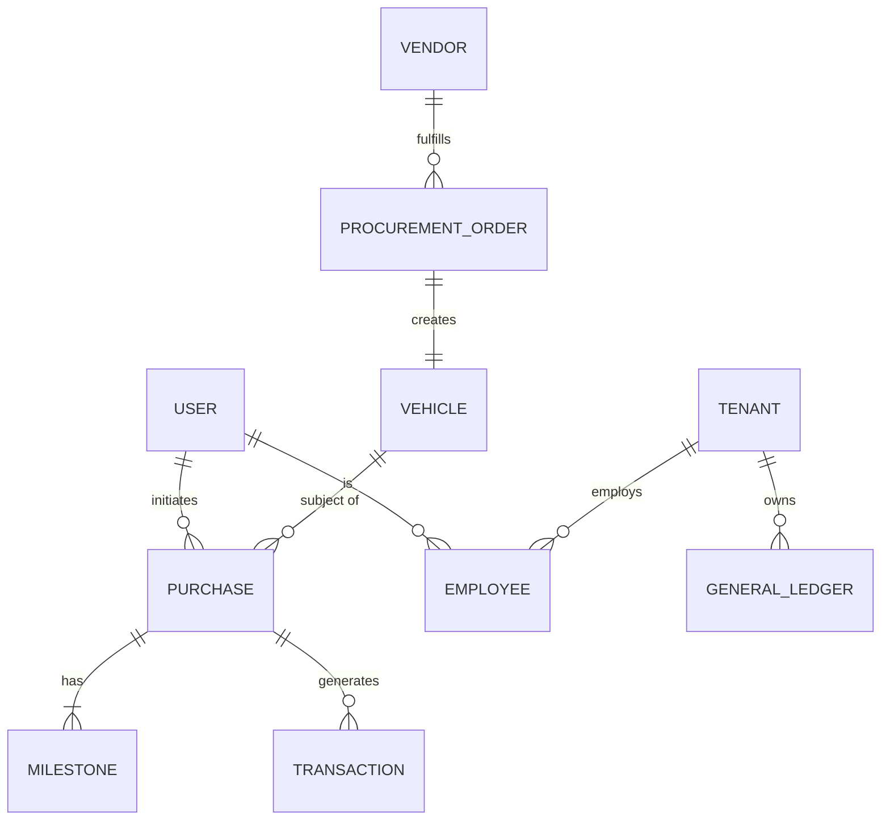

# ERP System: Database Schema & Data Model (Consolidated)

## 1. Core Architecture: Prisma Schema (Existing)
The core vehicle commerce logic is driven by the existing [schema.prisma](file:///Users/anurag/coding/solo/solo/app/prisma/schema.prisma). All enterprise modules will build upon this foundation.

### 1.1 Existing Models
- **User**: Wallet-based identity and authentication.
- **Vehicle**: Asset inventory (VIN, model, color, price, status).
- **Purchase**: Transaction orchestrator (buyer, vehicle, escrow PDA, status).
- **Milestone**: Production/Delivery lifecycle synchronization.
- **KycRecord**: Compliance and identity verification.
- **AuditLog**: Immutable action history.

## 2. Enterprise Extension Strategy

To support 10,000+ tenants and the required enterprise modules, we will implement a **Multi-Tenant extension** layer.

### 2.1 Multi-Tenancy Model
We use a **Schema-per-Tenant** approach for the new enterprise modules, while the core `public` schema (managed by Prisma) will handle shared metadata and cross-tenant identities.

**Extension: public.tenants**
| Column | Type | Constraints |
|---|---|---|
| `id` | `uuid` | Primary Key |
| `name` | `varchar(255)` | Not Null |
| `subdomain` | `varchar(63)` | Not Null, Unique |
| `config` | `jsonb` | Regional settings, currencies, etc. |

## 3. New Enterprise Module Schemas

### 3.1 Financial Accounting (GAAP/IFRS Compliant)
Builds on top of `Purchase` and `Vehicle` data.

**GeneralLedger**
| Column | Type | Constraints |
|---|---|---|
| `id` | `uuid` | Primary Key |
| `tenant_id` | `uuid` | FK to Tenants |
| `account_code` | `varchar(20)` | Not Null |
| `description` | `text` | |
| `balance` | `decimal(18, 2)` | |

**Transaction**
| Column | Type | Constraints |
|---|---|---|
| `id` | `uuid` | Primary Key |
| `purchase_id` | `cuid` | FK to Prisma Purchase |
| `amount` | `decimal(18, 2)` | |
| `currency` | `varchar(3)` | ISO Code |

### 3.2 Human Resources (Employee Lifecycle)
Expands on the `User` and `KycRecord` pattern.

**Employee**
| Column | Type | Constraints |
|---|---|---|
| `id` | `uuid` | Primary Key |
| `user_id` | `cuid` | FK to Prisma User |
| `tenant_id` | `uuid` | FK to Tenants |
| `role` | `varchar(50)` | RBAC Role |
| `salary_data` | `jsonb` | Encrypted |

### 3.3 Supply Chain & Vendor Management
Connects to the `Vehicle` inventory.

**Vendor**
| Column | Type | Constraints |
|---|---|---|
| `id` | `uuid` | Primary Key |
| `name` | `varchar(255)` | Not Null |
| `rating` | `int` | Performance metric |

**ProcurementOrder**
| Column | Type | Constraints |
|---|---|---|
| `id` | `uuid` | Primary Key |
| `vendor_id` | `uuid` | FK to Vendor |
| `vehicle_id` | `cuid` | FK to Prisma Vehicle |

## 4. Entity-Relationship Diagram (Consolidated)

