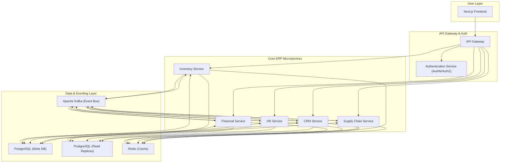

# ERP System: High-Level Architecture & Design

## 1. Technology Stack & Current State

The platform is currently built as a **Next.js** application (`/solo/app`) with a **Prisma/PostgreSQL** backend. Our enterprise expansion will follow a hybrid model:

*   **Frontend**: Next.js (Existing) - Handles Buyer/Seller UIs and core transaction flows.
*   **API Layer (Core)**: Next.js API Routes (Existing) - Handles identity, vehicle listing, and purchase status.
*   **Enterprise Microservices (New)**: Node.js with TypeScript + Fastify (Located in `/solo/offchain`) - Handles heavy enterprise modules (Financials, HR, SCM) to ensure high throughput and separation of concerns.
*   **ORM**: Prisma (Existing) for core data; Knex/TypeORM for complex enterprise queries if needed.
*   **Database**: PostgreSQL (Existing) with Schema-per-Tenant isolation for enterprise data.
*   **Message Bus**: Apache Kafka - Synchronizes data between the Next.js core and enterprise microservices.

## 2. Architectural Principles

*   **Microservices**: Each core ERP module (Inventory, Financials, HR, CRM, Supply Chain) will be an independent microservice.
*   **API-First**: All functionality will be exposed via RESTful and GraphQL APIs.
*   **Event-Driven**: Services will communicate asynchronously via a central message bus (Kafka) to ensure loose coupling and scalability.
*   **CQRS (Command Query Responsibility Segregation)**: We will separate read and write operations to optimize performance. Write operations go to the primary PostgreSQL database, while read-heavy queries can be served by optimized read replicas or even specialized data stores (e.g., Elasticsearch for search).
*   **Multi-Tenancy**: Data will be isolated at the database level using a schema-per-tenant strategy. A shared `public` schema will manage tenant metadata.

## 3. System Diagram

