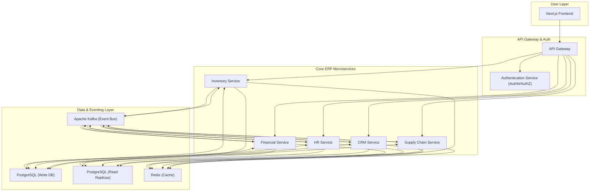

# ERP System: High-Level Architecture & Design

## 1. Technology Stack

*   **Backend Framework**: Node.js with TypeScript
*   **API Framework**: Fastify (chosen for its high performance and low overhead compared to Express)
*   **Frontend Framework**: Next.js (as per requirements)
*   **Database**: PostgreSQL (for its robustness, support for JSONB, and transactional integrity)
*   **Cache**: Redis (for caching, session management, and as a message broker for simple events)
*   **Message Bus**: Apache Kafka (for the main event-driven backbone, ensuring durability and scalability)
*   **Containerization**: Docker
*   **Orchestration**: Kubernetes

## 2. Architectural Principles

*   **Microservices**: Each core ERP module (Inventory, Financials, HR, CRM, Supply Chain) will be an independent microservice.
*   **API-First**: All functionality will be exposed via RESTful and GraphQL APIs.
*   **Event-Driven**: Services will communicate asynchronously via a central message bus (Kafka) to ensure loose coupling and scalability.
*   **CQRS (Command Query Responsibility Segregation)**: We will separate read and write operations to optimize performance. Write operations go to the primary PostgreSQL database, while read-heavy queries can be served by optimized read replicas or even specialized data stores (e.g., Elasticsearch for search).
*   **Multi-Tenancy**: Data will be isolated at the database level using a schema-per-tenant strategy. A shared `public` schema will manage tenant metadata.

## 3. System Diagram

