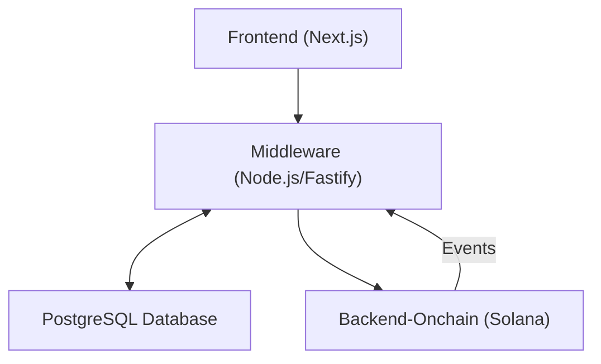
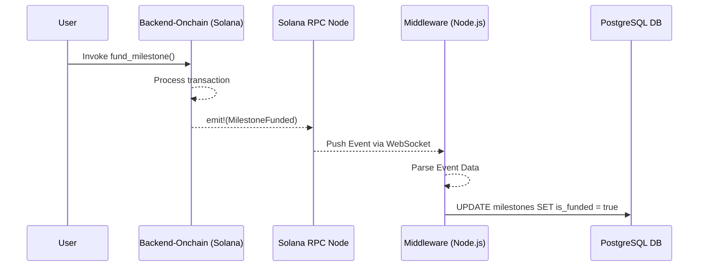

# Middleware Architecture

This document outlines the architecture for the off-chain middleware services that support the SRWA platform.

## 1. Core Responsibilities

*   **API Gateway**: Provide a single, unified entry point for the frontend.
*   **Authentication & Authorization**: Manage user sessions and role-based access.
*   **Data Indexing**: Read data from the Solana blockchain and store it in PostgreSQL for efficient querying.
*   **Business Logic**: Execute complex business logic that is not suitable for on-chain execution.

## 2. Simplified Architecture (Hackathon Scope)

For the current phase, we will use a simplified, monolithic approach for the middleware, using Node.js and Fastify.

## 4. On-Chain Event Indexing

The Middleware is responsible for keeping the off-chain PostgreSQL database synchronized with the on-chain state. It does this via Solana's WebSocket Pub/Sub API.

### 4.1 Event Flow

### 4.2 Implementation Details

1.  **Subscription**: The Middleware uses a library like `@solana/web3.js` to open a WebSocket connection and subscribe to the logs of the on-chain program address.
2.  **Event Parsing**: An `Anchor` event parser is used to decode the raw log data into a structured JavaScript object.
3.  **Idempotency**: The Middleware will track processed transaction signatures in Redis to prevent processing the same event twice in case of a connection flicker.
